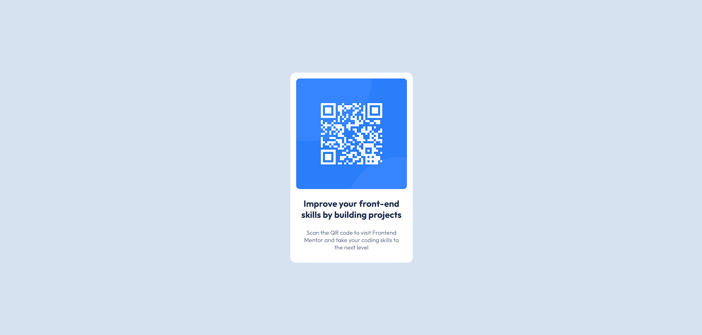

# Frontend Mentor - QR code component solution

This is a solution to the [QR code component challenge on Frontend Mentor](https://www.frontendmentor.io/challenges/qr-code-component-iux_sIO_H). Frontend Mentor challenges help you improve your coding skills by building realistic projects.

## Table of contents

- [Overview](#overview)
  - [Screenshot](#screenshot)
  - [Links](#links)
- [My process](#my-process)
  - [Built with](#built-with)
  - [What I learned](#what-i-learned)
- [Author](#author)

## Overview

### Screenshot

### Links

- Solution URL: [Github Repository](https://github.com/pouryapb/fem-qr-code-component)
- Live Site URL: [gh-pages](https://pouryapb.github.io/fem-qr-code-component)

## My process

### Built with

- Semantic HTML5 markup
- CSS custom properties
- Flexbox
- Mobile-first workflow

### What I learned

The only challenge this one had was centering the div 😉

## Author

- Website - [Pourya Pourbagheri](https://portfolio-pouryapb.vercel.app/)
- Frontend Mentor - [@pouryapb](https://www.frontendmentor.io/profile/pouryapb)
- Linkedin - [@pouryapb](https://www.linkedin.com/in/pouryapb)
